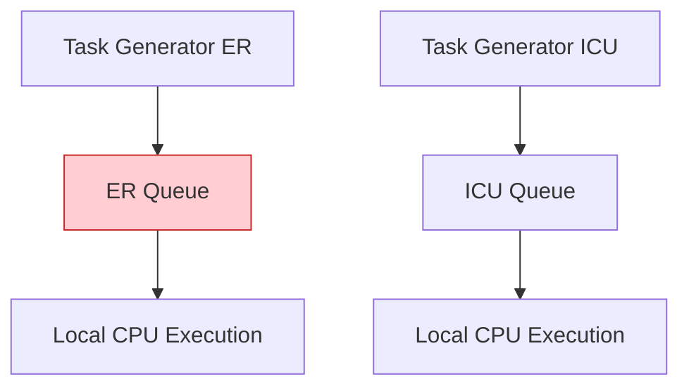
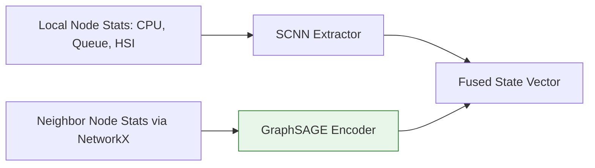
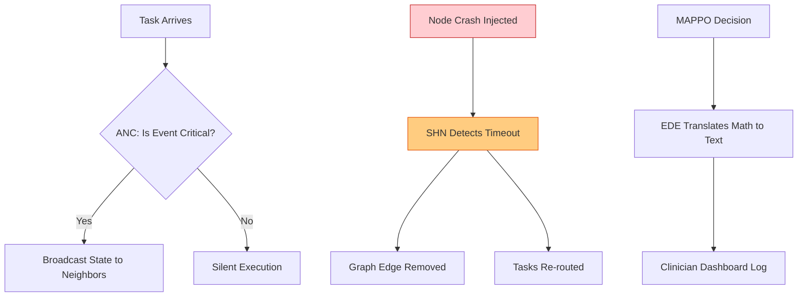

# GraphMARL: Comprehensive Implementation Phases Plan

This document outlines the detailed, step-by-step implementation roadmap for the GraphMARL framework. Each phase builds upon the previous one, gradually transforming a "dumb" discrete-event simulator into a fully decentralized, intelligent, and self-healing hospital edge orchestration system.

---

## Phase 1: The Foundation - Hospital Graph Simulator
**Goal:** Build the environment where the RL agents will live.
**Focus:** Infrastructure, topology, and basic task processing.

### Detailed Explanation
Before adding any intelligence, we need a baseline simulation. This phase establishes the hospital topology using `NetworkX` and sets up the time-stepped simulation using `SimPy`. Every department (e.g., ICU, ER, Radiology) is instantiated as an `EdgeNode` with a specific CPU capacity and a local queue. Tasks arrive via a Poisson process and are processed *locally*—meaning if a node's queue overflows, deadlines are missed.

### Phase 1 Architecture

*Note: In Phase 1, there is strictly no communication between nodes.*

---

## Phase 2: Workload Generation & Health Severity Index (HSI)
**Goal:** Introduce medical realism and task prioritization.
**Focus:** HTCF (Hybrid Task Characterization Framework) & HSPE (Health Severity Priority Encoder).

### Detailed Explanation
Not all tasks are equal. An ECG anomaly is more critical than a routine blood report. In this phase, we implement the **HSI**. Tasks are assigned a severity score $[0, 1]$. We also implement the **Human-in-the-Loop (HITL)** override, where simulated doctors can flag tasks as emergencies (HSI = 1.0). The local node queues are upgraded from standard FIFO queues to Priority Queues based on HSI and deadlines.

---

## Phase 3: Dynamic Graph Representation & Local State (SCNN)
**Goal:** Enable nodes to perceive their own resource limits.
**Focus:** DHGC (Dynamic Hospital Graph Constructor) & SCNN.

### Detailed Explanation
To make intelligent decisions, a node must first understand itself. We implement a **Stacked CNN (SCNN)** that compresses the local node's high-dimensional time-series state (CPU utilization, GPU utilization, current queue length, average HSI of queue) into a dense, fixed-size local feature vector. Concurrently, the DHGC continuously monitors this state and updates the node features on the global graph.

---

## Phase 4: Neighborhood Intelligence (GraphSAGE)
**Goal:** Allow nodes to understand the state of their immediate surroundings without global knowledge.
**Focus:** GraphSAGE (Neighbor-Aware Graph Embedding Network).

### Detailed Explanation
This is where graph intelligence is injected. An isolated node cannot offload effectively. We implement **GraphSAGE**, a Graph Neural Network that aggregates the feature vectors of a node's *direct neighbors only*. For example, the ER aggregates states from the ICU and Ward. The GNN outputs a neighborhood embedding, which is then concatenated with the SCNN local state to form a complete **Fused State Representation**.

### Phase 3 & 4 Architecture

---

## Phase 5: The Decision Engine (UA-MAPPO & AMRF)
**Goal:** Train autonomous agents to make offloading decisions based on the fused state.
**Focus:** Uncertainty-Aware MAPPO & Adaptive Multi-Objective Reward Function.

### Detailed Explanation
We wrap the SimPy environment in a standard `PettingZoo` Multi-Agent interface. Each node acts as an independent agent powered by **PPO**. The agent takes the Fused State from Phase 4 and outputs an action: `[Execute Local, Offload to Neighbor_1, Offload to Neighbor_2, Queue]`. 
We implement the **AMRF**:
- *Emergency Mode:* Heavily penalizes latency and deadline misses.
- *Normal Mode:* Rewards energy efficiency and resource utilization.
We also add **Uncertainty-Awareness**: if neighbor data is stale, the variance of the Q-value prediction increases, mathematically penalizing the agent from offloading to that uncertain neighbor.

---

## Phase 6: Advanced Scheduling Objectives (PCAS & FATS)
**Goal:** Shift from reactive scheduling to proactive, fair scheduling.
**Focus:** Predictive Congestion-Aware Scheduling (PCAS) & Fairness-Aware Task Scheduling (FATS).

### Detailed Explanation
Currently, agents react to high queues. We implement **PCAS** using an ultra-lightweight Auto-Regressive model to forecast the queue size at $t+1$. The agent uses this prediction to avoid offloading to neighbors that *will be* congested shortly. Simultaneously, **FATS** is introduced as a fairness penalty in the AMRF to ensure the AI doesn't exploit a single high-compute node (like Radiology) to the point of burnout.

---

## Phase 7: Event-Driven Negotiation (ANC)
**Goal:** Drastically reduce network bandwidth overhead.
**Focus:** Adaptive Neighbor Communication (ANC) Protocol.

### Detailed Explanation
Up until now, nodes pulled neighbor states constantly every tick. This is unrealistic for hospital Wi-Fi. We implement **ANC**, where nodes remain silent until a critical threshold is crossed (e.g., Queue jumps by 20%, CPU hits 90%, emergency task arrives). Only then do they broadcast their updated state to neighbors. The MARL agents must learn to navigate this partial observability.

---

## Phase 8: Robustness & Transparency (SHN & EDE)
**Goal:** Survive node crashes and provide clinical explanations for routing.
**Focus:** Self-Healing Network (SHN) & Explainable Decision Engine (EDE).

### Detailed Explanation
We inject chaos into the simulation: random node crashes and network partitions. The **SHN** detects heartbeat timeouts, reorganizes the graph, and automatically redistributes orphaned tasks.
Concurrently, we implement the **EDE**. The neural network's mathematical output is parsed into a human-readable log (e.g., `Routed to ICU | Reason: Local Queue Full, ICU predicted latency < 200ms, Task HSI Critical`).

### Phase 7 & 8 Architecture

---

## Phase 9: Jetson Hardware Validation
**Goal:** Prove the framework works outside of a Python simulator.
**Focus:** Real-world Edge Deployment.

### Detailed Explanation
We freeze the trained PyTorch actor networks into optimized TensorRT engines. The Python SimPy environment is swapped for real physical hardware: NVIDIA Jetson Orin (ICU), Jetson Xavier (Radiology), and Jetson Nanos (Wards). We deploy the logic via Docker containers. Tasks are actually transmitted over a physical network switch, where Linux `tc` injects realistic packet loss and delay.

---

## Phase 10: Final Evaluation & Benchmarking
**Goal:** Gather hard data to prove GraphMARL's superiority.
**Focus:** Metrics collection and Ablation studies.

### Detailed Explanation
We execute massive test suites on both the simulator (scale: 500 nodes) and the hardware cluster (scale: 5 nodes). We compare GraphMARL against:
1. **Local Only** (Phase 1 Baseline)
2. **Centralized Cloud Broker**
3. **Vanilla Distributed RL** (Baseline paper without GraphSAGE)
4. **Greedy-Queue Handoff**

We extract data for Latency, Deadline Satisfaction, Energy Consumption, and Bandwidth saved by ANC, finalizing the plots and tables for the research publication.
