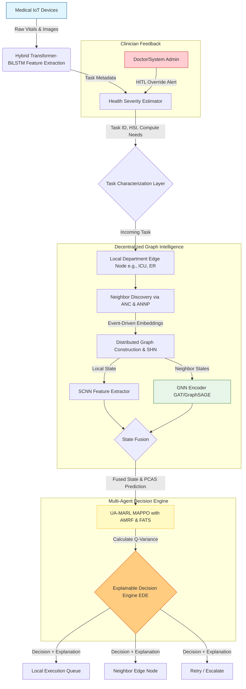
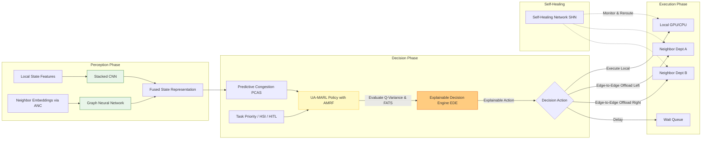

# GraphMARL: Graph Neural Multi-Agent Reinforcement Learning for Fully Decentralized Peer-to-Peer Hospital Edge Orchestration

## 1. Problem Statement & Baseline
While recent literature, including the baseline paper ("Task prioritization and distributed deep reinforcement learning for healthcare management in Cloud-Edge environments"), introduces effective methods for prioritizing healthcare tasks using a Health Severity Index (HSI) and Distributed Deep Reinforcement Learning (DRL), it suffers from several critical limitations:
- **Centralized Orchestration:** It relies on a logically centralized orchestrator or global state knowledge for task offloading.
- **Vertical Offloading Only:** It focuses on Device-to-Edge and Edge-to-Cloud offloading, missing the massive potential of horizontal Edge-to-Edge (Peer-to-Peer) collaboration across hospital departments.
- **Lack of Graph Intelligence:** It ignores the inherent graph-like topology of interconnected hospital departments.
- **Simulation-Only Validation:** It lacks validation on real-world hardware under realistic communication failures.
- **Single Point of Failure:** Centralized scheduling makes the system vulnerable to node crashes and network partitions.

## 2. Proposed Solution: How We Will Solve These Problems
Our proposed framework, **GraphMARL**, completely eliminates the central scheduler. Every hospital department (e.g., ICU, Radiology, ER) acts as an autonomous, intelligent edge agent capable of Peer-to-Peer collaboration. We solve the gaps in the base paper through the following methodologies:

- **Fully Decentralized Peer-to-Peer Orchestration:** Nodes make decisions independently. If a node fails, the rest of the hospital continues to function, routing tasks horizontally to other departments.
- **Dynamic Hospital Graph Representation:** The hospital is modeled as a dynamic graph $G = (V, E)$, where vertices are departments and edges are communication links. Node and edge features update continuously.
- **Hybrid State Fusion (SCNN + GNN):** We utilize a Stacked CNN (SCNN) to compress the local department's high-dimensional state (compute, energy) and fuse it with a Graph Neural Network (GNN) that aggregates compact neighbor embeddings. 
- **Uncertainty-Aware Decentralized Decision Making:** We integrate an Uncertainty-Aware Multi-Agent Proximal Policy Optimization (MAPPO) algorithm. The agent calculates the variance of its Q-value predictions for neighboring nodes. If neighbor data is stale or network congestion is high, the agent penalizes offloading to that neighbor, preventing catastrophic delays for critical medical tasks.
- **Human-in-the-Loop (HITL) Override:** Unlike purely autonomous systems, clinicians can inject real-time priority overrides which dynamically propagate through the graph, forcing neighboring nodes to clear their queues for emergency tasks.
- **Real Hardware Validation:** We will deploy the system on a testbed of NVIDIA Jetson boards (Nano, Xavier, Orin) simulating real hospital departments, injecting realistic network delays, packet loss, and node crashes.

---

## 3. Core Methodologies Introduced

### A. Dynamic Hospital Graph Constructor (DHGC)
Maintains the evolving graph of departments and communication links using local observations. Features include CPU/GPU utilization, queue length, and network bandwidth.

### B. Hybrid Perception Network (SCNN + NAGEN)
Combines two perception layers:
1. **SCNN:** Compresses high-dimensional local state parameters.
2. **Neighbor-Aware Graph Embedding Network (NAGEN):** Utilizes GNNs (like GraphSAGE) to produce node embeddings from local neighborhoods. 
The fused embedding (`[Local SCNN | Neighbor GNN]`) captures both local capacity and surrounding hospital congestion without global knowledge.

### C. Health Severity Priority Encoder (HSPE) & HITL Override
Extends the Health Severity Index (HSI). HSI is integrated directly into the MARL state space. Furthermore, the **HITL Override Protocol** allows clinicians to manually flag tasks as emergencies, instantly elevating the task's HSI and propagating "Emergency Override Embeddings" to neighbors.

### D. Uncertainty-Aware GraphMARL Scheduler (UA-GMS)
A multi-agent policy where each node learns independently. 
To prevent risky offloading due to stale neighbor information, the Q-learning objective incorporates variance-based uncertainty estimation. High prediction variance mathematically penalizes the action.
The Reward function is multi-objective:
$$R = \alpha U - \beta L - \gamma E - \delta D - \eta C + \lambda P - \mu \text{Var}(Q)$$
Where $U$ is utilization, $L$ is latency, $E$ is energy, $D$ is deadline misses, $C$ is communication cost, $P$ is critical-task completion, and $\text{Var}(Q)$ is the prediction uncertainty penalty.

### E. Adaptive Neighbor Negotiation Protocol (ANNP)
A lightweight protocol for exchanging compact graph embeddings and predicted finish times instead of full resource tables, drastically reducing communication overhead.

### F. Self-Healing Network (SHN) [Enhanced DFRM]
An upgrade to the Dynamic Failure Recovery Module (DFRM). Beyond merely detecting failures, the SHN automatically reorganizes neighbor connections, redistributes the workload, and continues execution without any administrator intervention. 
* **Benefits:** Higher fault tolerance, faster recovery, and vastly improved robustness.

### G. Adaptive Neighbor Communication (ANC)
Replaces the old periodic information exchange. Nodes now communicate *only* when important events occur, such as: sudden queue increases, emergency patient arrivals, CPU/GPU overloads, network congestion, or neighbor failures.
* **Benefits:** Lower communication overhead, lower bandwidth usage, and significantly better scalability.

### H. Adaptive Multi-Objective Reward Function (AMRF)
Instead of fixed reward weights, AMRF makes reward weights adaptive based on hospital conditions. 
* **Emergency Mode:** Latency and deadline satisfaction → High priority; Energy → Low priority.
* **Normal Mode:** Energy efficiency and resource utilization → High priority; Latency → Moderate priority.
* **Benefits:** Context-aware scheduling, better emergency handling, and improved energy efficiency.

### I. Explainable Decision Engine (EDE)
Augments the scheduler to provide an explanation alongside every decision rather than just outputting the selected department. 
* **Example Rationale:** `Task → ER | Reason: Queue Length = 2, CPU Utilization = 45%, Predicted Finish Time = 1.3 sec, Reliability Score = 0.97, HSI = High`.
* **Benefits:** Explainable AI, higher clinician trust, easier debugging, and better regulatory compliance.

### J. Predictive Congestion-Aware Scheduling (PCAS)
Shifts the system from reactive to proactive scheduling. Instead of waiting for congestion to happen before making a decision, PCAS predicts future congestion before offloading and avoids routing tasks to predicted bottlenecks.
* **Benefits:** Lower waiting time, fewer deadline misses, and proactive scheduling.

### K. Fairness-Aware Task Scheduling (FATS)
Upgrades fairness from a passing mention into a dedicated scheduling objective. FATS incorporates a fairness term directly into the reward function to prevent any single department from becoming overloaded and to balance the long-term workload among all departments.
* **Benefits:** Balanced utilization, reduced starvation, and improved long-term stability.

---

## 4. Workflows & Architecture Diagrams

### System Architecture Workflow

### GraphMARL Decision Flow (Perception to Execution)

---

## 5. Our 15 Contributions

1. **Fully Decentralized Architecture:** Propose the first fully decentralized peer-to-peer hospital edge orchestration framework without any central scheduler.
2. **Horizontal Edge-to-Edge Collaboration:** Shift the paradigm from vertical (Device-to-Cloud) offloading to lateral Peer-to-Peer department collaboration.
3. **Dynamic Graph Modeling & Self-Healing:** Model the hospital infrastructure as a dynamic graph equipped with a Self-Healing Network (SHN) to auto-recover from node crashes.
4. **Hybrid Perception Module (SCNN + GNN):** Introduce a dual-perception architecture combining SCNNs for high-dimensional local states and GNNs for neighborhood-aware resource representation.
5. **GraphMARL Framework:** Develop a GraphMARL scheduling framework by integrating Graph Neural Networks with Multi-Agent Reinforcement Learning.
6. **Uncertainty-Aware Decentralized Policy:** Implement an uncertainty estimation mechanism that calculates Q-value variance to prevent high-risk offloading in dynamic, partially observable network conditions.
7. **Human-in-the-Loop (HITL) Override:** Design a closed-loop feedback mechanism allowing clinicians to inject real-time priority overrides that instantly propagate through the graph.
8. **Event-Driven Adaptive Negotiation:** Design a lightweight neighbor-to-neighbor negotiation protocol using Adaptive Neighbor Communication (ANC) to drastically cut overhead.
9. **Adaptive Multi-Objective Reward (AMRF):** Dynamically shift reward priorities between Emergency Mode (latency-focused) and Normal Mode (energy-focused).
10. **Explainable AI in Scheduling (EDE):** Introduce an Explainable Decision Engine that outputs readable rationale for all offloading decisions, improving clinician trust.
11. **Predictive Congestion Avoidance (PCAS):** Shift from reactive to proactive load balancing by predicting and bypassing future department bottlenecks.
12. **Fairness-Aware Workloads (FATS):** Incorporate fairness-aware decentralized scheduling to balance long-term workloads among hospital departments, preventing starvation.
13. **HSI-Integrated Scheduling:** Develop deadline-aware and Health Severity Index (HSI)-based intelligent task scheduling for critical healthcare applications.
14. **Real Hardware Validation:** Validate the proposed framework on a real Jetson-based hospital edge testbed in addition to extensive simulations.
15. **Comprehensive Superiority:** Demonstrate improved latency, explainability, resource utilization, scalability, robustness, and fault tolerance over existing healthcare edge scheduling approaches.
