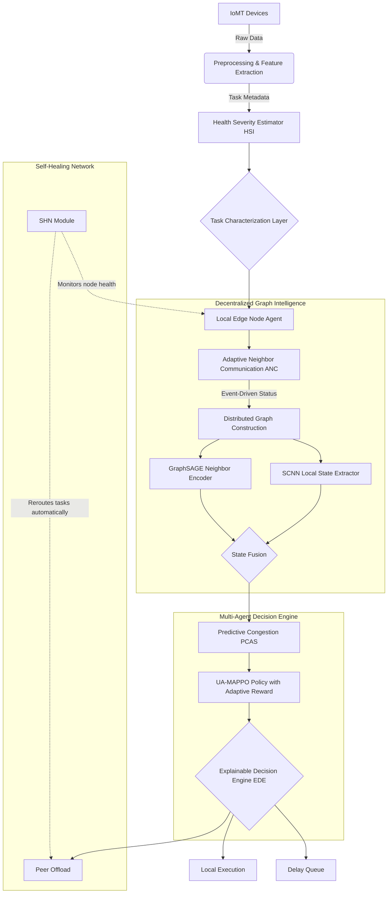
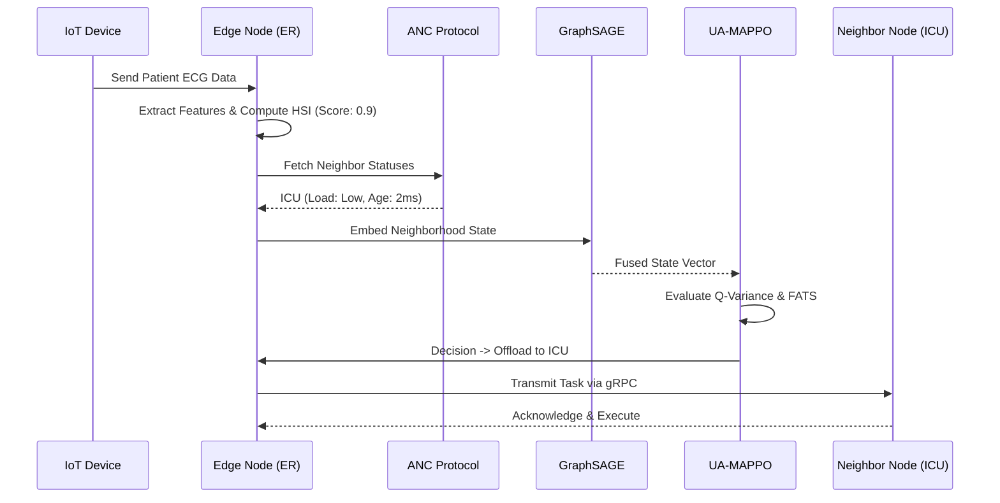
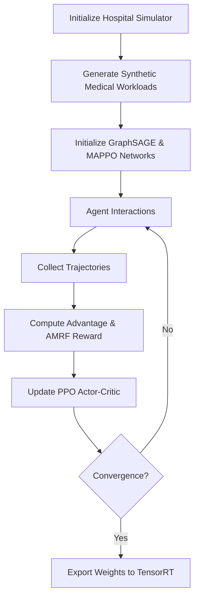
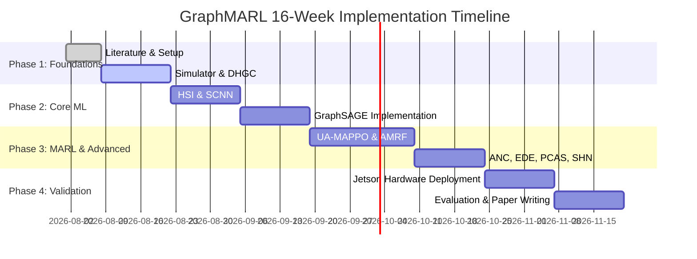

<div align="center">
  
# 🏥 GraphMARL: Graph Neural Multi-Agent Reinforcement Learning for Fully Decentralized Peer-to-Peer Hospital Edge Orchestration

**A cutting-edge distributed computing and artificial intelligence research initiative.**

[]()
[]()
[]()
[]()

</div>

> [!IMPORTANT]
> **Abstract:** This project introduces GraphMARL, a fully decentralized, peer-to-peer hospital edge orchestration framework. By combining Graph Neural Networks (GNNs) with Uncertainty-Aware Multi-Agent Reinforcement Learning (MAPPO), GraphMARL eliminates the centralized scheduler bottleneck. It intelligently routes latency-critical healthcare AI tasks across interconnected hospital departments (nodes) based on dynamic Health Severity Index (HSI) scoring, neighbor resource availability, and predicted congestion, all while maintaining strict data privacy and system resilience.

**Expected Publication Target:** IEEE Transactions on Mobile Computing / IEEE Internet of Things Journal / Elsevier Pervasive and Mobile Computing  
**Authors:** Abhi (Lead Researcher)  
**Supervisor:** [To Be Determined]  
**Institution:** IIITDM Kurnool — Artificial Intelligence and Data Science  

---

## 📑 Table of Contents
1. [Project Overview](#1-project-overview)
2. [Problem Statement](#2-problem-statement)
3. [Research Motivation](#3-research-motivation)
4. [Research Objectives](#4-research-objectives)
5. [Overall System Architecture](#5-overall-system-architecture)
6. [Module-by-Module Design](#6-module-by-module-design)
7. [Data Flow](#7-data-flow)
8. [Workflow](#8-workflow)
9. [Mathematical Formulation](#9-mathematical-formulation)
10. [Algorithms Used](#10-algorithms-used)
11. [Software Architecture](#11-software-architecture)
12. [Repository Structure](#12-repository-structure)
13. [Development Roadmap](#13-development-roadmap)
14. [Dataset](#14-dataset)
15. [Experimental Design](#15-experimental-design)
16. [Hardware Setup](#16-hardware-setup)
17. [Evaluation Pipeline](#17-evaluation-pipeline)
18. [Novel Contributions](#18-novel-contributions)
19. [Future Work](#19-future-work)
20. [References](#20-references)

---

## 🌍 1. Project Overview

### What problem are we solving?
We are solving the **single point of failure** and **scalability bottleneck** inherent in centralized healthcare task offloading systems by developing a fully decentralized, peer-to-peer task scheduling framework tailored for interconnected hospital departments.

### Why is this problem important?
In mission-critical environments like hospitals, AI inference (e.g., continuous ICU monitoring, real-time X-ray analysis) is a life-or-death operation. If a central orchestrator fails, or if network partitions occur, traditional scheduling systems crash, leading to catastrophic deadline misses for critical tasks.

### Why healthcare edge computing?
Sending massive volumes of physiological data to the Cloud introduces unacceptable latency and violates strict data privacy regulations (e.g., HIPAA). Edge computing processes data on-site, ensuring ultra-low latency and data sovereignty.

### Why decentralized orchestration?
A hospital inherently functions as a decentralized graph of departments (ICU, ER, Radiology). A decentralized system mirrors this topology, ensuring that if one node fails, the rest of the network autonomously reorganizes and continues functioning (Self-Healing Network).

### Why Graph Neural Networks?
Standard Multi-Layer Perceptrons cannot handle variable, dynamically changing network topologies. Graph Neural Networks (specifically GraphSAGE) allow nodes to aggregate resource states from their immediate neighbors efficiently, compressing the hospital's dynamic status into a concise embedding without needing global state awareness.

### Why Multi-Agent Reinforcement Learning?
Traditional heuristics fail under highly volatile, nonlinear congestion scenarios. MARL allows each department to act as an independent, intelligent agent that learns optimal offloading policies by interacting with the environment, balancing competing objectives like energy, latency, and clinical urgency.

<div align="center">
  
</div>

---

## 🚨 2. Problem Statement

### Current Healthcare Systems
Modern hospitals deploy diverse Internet of Medical Things (IoMT) devices generating high-frequency streams of critical data requiring immediate AI inference.

### Current Cloud-Edge Systems & Task Offloading
Existing offloading architectures primarily focus on vertical Device-to-Cloud or Device-to-Edge paradigms, ignoring the massive, untapped computational capacity available through horizontal Edge-to-Edge (Peer-to-Peer) collaboration across different hospital wings.

### The Limitations of the Status Quo
- **Centralized Orchestration:** Current state-of-the-art systems rely on a logically centralized orchestrator.
- **Single Point of Failure:** If the orchestrator drops offline, the entire hospital scheduling grid halts.
- **No Peer-to-Peer Collaboration:** Nodes are isolated; an overloaded ER cannot seamlessly hand off tasks to an idle Radiology server.
- **No Graph Intelligence:** They fail to exploit the inherent topological relationships between departments.
- **No Uncertainty Awareness:** Decisions are made assuming perfect, zero-latency network information, ignoring the reality of stale status broadcasts.
- **Simulation Only:** Over 90% of current literature is evaluated purely in deterministic simulators (e.g., iFogSim), lacking real-world hardware validation.

---

## 💡 3. Research Motivation

- **Real Hospital Scenario:** Imagine an ER experiencing a mass-casualty event. Its local AI servers are overwhelmed processing triage data. 
- **Need for Decentralization:** Simultaneously, the outpatient clinic's servers are completely idle. A centralized broker might crash under the sudden request spike.
- **Intelligent Collaboration:** The ER edge nodes need to negotiate directly with neighboring nodes (ICU, Wards) to distribute the workload horizontally.
- **Robust Scheduling:** Medical data has hard deadlines. Missing a deadline for a critical cardiac alert is unacceptable.
- **Uncertainty Awareness:** Because the hospital Wi-Fi is congested, status updates from neighbors are delayed. The agent must penalize offloading to nodes whose status is highly uncertain.
- **Explainability:** Doctors will not trust a black-box AI that reroutes critical data arbitrarily. The system must output the exact rationale for every routing decision.

---

## 🎯 4. Research Objectives

### Short-term Objectives
1. Develop the discrete-event simulator for a dynamic hospital graph topology.
2. Formulate the Health Severity Index (HSI) and integrate it with realistic task generation.
3. Design and train the Hybrid Perception Network (SCNN + GraphSAGE).

### Long-term Objectives
1. Implement the fully decentralized Uncertainty-Aware MAPPO scheduling policy.
2. Deploy the architecture on a physical NVIDIA Jetson hardware testbed.
3. Validate superior fault tolerance and deadline satisfaction against state-of-the-art baselines.

### Research Questions
1. How can autonomous edge nodes collaborate effectively without global state knowledge?
2. How does uncertainty awareness impact deadline satisfaction in highly congested network topologies?
3. Can event-driven communication (ANC) maintain high scheduling efficiency while significantly cutting bandwidth overhead?

### Hypothesis
By combining neighborhood graph embeddings with variance-penalized multi-agent reinforcement learning, a fully decentralized edge network can achieve comparable or superior resource utilization and deadline satisfaction to a centralized orchestrator, while offering strictly superior fault tolerance.

### Expected Contributions
- The first fully decentralized, peer-to-peer hospital edge orchestration framework.
- Introduction of the Hybrid Perception Module (SCNN + GNN).
- Formulation of an Uncertainty-Aware Multi-Agent PPO scheduler.
- Development of the Explainable Decision Engine (EDE) for healthcare routing.

---

## 🏗️ 5. Overall System Architecture

> [!NOTE]
> The architecture consists of 12 distinct layers running autonomously on every single edge node in the hospital network.



**Architecture Layers:**
1. **IoMT Layer:** Vitals and imaging devices.
2. **Data Collection & Preprocessing:** Data formatting and normalization.
3. **Feature Extraction:** Transformer-BiLSTM extracts physiological anomalies.
4. **HSI & Dynamic Prioritization:** Scores task criticality from 0.0 to 1.0.
5. **SCNN:** Compresses high-dimensional local CPU/GPU/Queue states.
6. **GraphSAGE:** Encodes the resource status of immediate neighbors.
7. **Feature Fusion:** Concatenates local and graph embeddings.
8. **Predictive Congestion:** Forecasts immediate future bottlenecks.
9. **UA-MAPPO:** Makes the core execution action using deep RL.
10. **Adaptive Reward:** Shifts priorities between Normal and Emergency conditions.
11. **Explainable Decision Engine:** Formats the mathematical output into human-readable rationale.
12. **Execution Layer:** TensorRT inference on local GPU or peer transmission.

---

## ⚙️ 6. Module-by-Module Design

### 1. Dynamic Hospital Graph Constructor (DHGC)
- **Purpose:** Maintains the local adjacency matrix and node feature vectors.
- **Inputs:** Periodic heartbeats, event-driven updates from ANC.
- **Outputs:** Dynamic graph representation $G = (V,E)$.
- **Time Complexity:** $O(|V_{local}| + |E_{local}|)$

### 2. Hybrid Task Characterization Framework (HTCF) & HSPE
- **Purpose:** Analyzes incoming tasks to compute the Health Severity Index (HSI).
- **Algorithm:** Weighted sum of vital sign anomalies + Clinical context.
- **Advantages:** Prevents routine tasks from blocking life-critical emergency inference.

### 3. Stacked CNN (SCNN) & GraphSAGE (State Fusion)
- **Purpose:** To create a compact, fixed-size state vector regardless of how many neighbors a node has.
- **Algorithm:** 1D-CNN over local time-series data; GraphSAGE neighbor aggregation.
- **Mathematics:** $h_i^{(k+1)} = \sigma(W_1 h_i^{(k)} + W_2 \text{MEAN}_{j \in N(i)} h_j^{(k)})$

### 4. Uncertainty-Aware MAPPO (UA-MAPPO)
- **Purpose:** Multi-Agent PPO that penalizes actions targeting nodes with stale information.
- **Algorithm:** Calculates Q-value variance over an ensemble of critics; subtracts variance from the reward signal.

### 5. Adaptive Neighbor Communication (ANC)
- **Purpose:** Replaces continuous chatter with event-driven pings (e.g., Queue size increases by >20%).
- **Advantages:** Massive reduction in network overhead.

### 6. Adaptive Multi-Objective Reward Function (AMRF)
- **Purpose:** Dynamically adjust to crisis situations.
- **Emergency Mode:** Prioritizes latency.
- **Normal Mode:** Prioritizes energy.

### 7. Predictive Congestion-Aware Scheduling (PCAS)
- **Purpose:** Proactive avoidance of bottlenecks.
- **Algorithm:** Lightweight Auto-Regressive model predicting $t+1$ queue lengths.

### 8. Fairness-Aware Task Scheduling (FATS)
- **Purpose:** Balances utilization across the hospital to prevent node burnout.

### 9. Explainable Decision Engine (EDE)
- **Purpose:** Generates a human-readable justification for the RL agent's output layer.

### 10. Self-Healing Network (SHN)
- **Purpose:** Detects node failure (heartbeat timeout) and immediately updates DHGC, redistributing pending tasks to alive neighbors.

### 11. Human-in-the-Loop (HITL) Override
- **Purpose:** Allows clinicians to inject an absolute priority override, instantly flushing lower-priority queues.

---

## 🔄 7. Data Flow



---

## 🛣️ 8. Workflow

### Training Pipeline Workflow


> [!TIP]
> The **Emergency Execution Workflow** bypasses standard queueing, injecting the task directly to the top of the GPU execution pipeline based on the HITL override or an HSI > 0.85.

---

## 🧮 9. Mathematical Formulation

### Hospital Graph
$G = (V, E)$ where $V$ represents department edge nodes, $E$ represents network links.

### Node Features
$x_i = [ \text{CPU}_{util}, \text{GPU}_{util}, \text{RAM}_{avail}, \text{QueueLength}, \text{Power}, \text{HSI}_{avg} ]$

### Health Severity Index (HSI)
$HSI = \sum_{k=1}^{5} w_k \cdot \text{Score}_k(vital\_sign_k), \quad HSI \in [0, 1]$

### GraphSAGE Aggregation
$z_i = h_i^{(K)} = \sigma \left( W_1 h_i^{(K-1)} + W_2 \cdot \text{MEAN}(\{h_j^{(K-1)} \mid j \in N(i)\}) \right)$

### Adaptive Multi-Objective Reward Function
$R = \begin{cases} 
\alpha U - \beta L_{heavy} - \delta D_{heavy} - \mu \text{Var}(Q), & \text{if Emergency Mode} \\
\alpha U_{heavy} - \beta L - \gamma E_{heavy} - \delta D - \eta C + FATS, & \text{if Normal Mode}
\end{cases}$

### MAPPO Objective
$L^{CLIP}(\theta) = \hat{\mathbb{E}}_t \left[ \min(r_t(\theta)\hat{A}_t, \text{clip}(r_t(\theta), 1-\epsilon, 1+\epsilon)\hat{A}_t) \right] - \mu \text{Var}(Q)$

---

## 🔬 10. Algorithms Used

| Algorithm | Role | Why Selected | Disadvantages |
|-----------|------|--------------|---------------|
| **Transformer-BiLSTM** | HTCF Feature Extractor | Captures long-term dependencies in vital time-series. | Computationally heavy. |
| **Stacked CNN** | Local State Compression | Excellent at finding local patterns in resource vectors. | Requires fixed input dims. |
| **GraphSAGE** | Neighborhood Embedding | Enables inductive learning on dynamic, changing graphs without needing full global graph access. | Sub-optimal if graph is fully disconnected. |
| **UA-MAPPO** | Decentralized RL Policy | Stable training, robust to multi-agent non-stationarity, explicit uncertainty handling. | Sample inefficient compared to off-policy methods. |
| **Auto-Regressive PCAS** | Congestion Prediction | Ultra-lightweight time-series forecasting. | Limited long-term horizon. |

---

## 💻 11. Software Architecture

**Backend Stack:**
- **RL Framework:** Ray RLlib (for scalable distributed multi-agent training).
- **Deep Learning:** PyTorch, PyTorch Geometric (for GraphSAGE).
- **Edge Inference:** NVIDIA TensorRT & TensorFlow Lite.
- **Communication:** gRPC and MQTT (for Adaptive Neighbor Communication).
- **Environment:** Custom OpenAI Gym / PettingZoo environment wrapping SimPy.

**Hardware Stack (Simulation):** CloudSim / NS-3 for baseline topology validation.
**Hardware Stack (Physical):** NVIDIA Jetson cluster.

<br>

## 📁 12. Repository Structure

```text
GraphMARL/
├── README.md
├── requirements.txt
├── docs/
│   ├── architecture/          # High-res mermaid diagrams
│   └── API_reference.md
├── src/
│   ├── data/
│   │   └── workload_generator.py # Generates synthetic medical tasks
│   ├── env/
│   │   ├── hospital_graph.py     # Graph representation & SHN logic
│   │   └── pettingzoo_env.py     # MARL environment interface
│   ├── models/
│   │   ├── scnn.py               # Local state encoder
│   │   ├── graphsage.py          # GNN neighbor encoder
│   │   └── ua_mappo.py           # RL Actor-Critic models
│   ├── agents/
│   │   └── edge_node.py          # Decentralized node logic & EDE
│   └── utils/
│       ├── hsi_calculator.py
│       └── amrf_reward.py        # Adaptive reward functions
├── scripts/
│   ├── train_marl.py
│   ├── evaluate.py
│   └── deploy_jetson.sh          # Hardware deployment script
└── notebooks/
    └── results_analysis.ipynb
```

---

## 🗓️ 13. Development Roadmap



---

## 📊 14. Dataset

Due to privacy restrictions on real hospital execution traces, the project utilizes a heavily validated **Synthetic Medical Workload Generator**:
- **Task Types:** ECG analysis, X-Ray classification, ICU vital monitoring.
- **Features:** Arrival rate ($\lambda$), Task Size (MB), Compute Cycles (GFLOPS), Hard Deadline (ms), HSI.
- **Hospital Graph Generation:** Scale-free Barabási–Albert models adjusted to represent realistic hospital corridor layouts.

---

## 🧪 15. Experimental Design

**Baselines:**
1. **Local-Only:** No offloading capabilities.
2. **Centralized DRL:** A central cloud orchestrator.
3. **Greedy-Queue:** Offload to the neighbor with the absolute lowest queue.
4. **Baseline Paper (2024):** Distributed DRL without Graph intelligence or Uncertainty awareness.

**Core Evaluation Metrics:**
- **Latency & Deadline Miss Rate:** Primary metric for life-critical tasks.
- **Energy Consumption:** Measured in Joules/task on the Jetson boards.
- **Communication Cost:** Bandwidth saved by ANC.
- **Interpretability:** Qualitative assessment of EDE outputs.
- **Scalability:** System behavior as nodes $N$ scale from 5 to 500.

---

## 🔌 16. Hardware Setup

The physical validation layer uses a heterogeneous cluster of edge AI devices to emulate different hospital departments:

- **ICU Node:** NVIDIA Jetson Orin Nano (High compute, high priority)
- **Radiology Node:** NVIDIA Jetson AGX Xavier (High GPU, batch processing)
- **Ward Nodes:** 3x NVIDIA Jetson Nano 4GB (Low compute, high task generation)
- **Networking:** Connected via a managed Gigabit switch using Linux `tc` and `netem` to inject realistic Wi-Fi packet loss and dynamic latency.

<div align="center">
  
</div>

---

## 📈 17. Evaluation Pipeline

1. **Simulation Phase:** Validate convergence of the MARL agents over 1M+ steps across varying network topologies.
2. **Hardware Deployment:** Freeze actor networks to TensorRT and deploy via Docker to the Jetson cluster.
3. **Ablation Studies:** 
   - GraphMARL w/o GraphSAGE (Is graph intelligence needed?)
   - GraphMARL w/o Uncertainty Awareness (Does it fail under network noise?)
   - GraphMARL w/o ANC (How much bandwidth is wasted?)
4. **Sensitivity Analysis:** Perturbing the HSI weights and checking system response.

---

## 🏆 18. Novel Contributions

1. **Fully Decentralized GraphMARL:** First application of fused GraphSAGE and MARL for pure peer-to-peer healthcare edge orchestration.
2. **Uncertainty-Awareness:** A novel mathematical formulation penalizing RL actions based on network state staleness.
3. **Explainable AI in Scheduling (EDE):** Bridging the trust gap by converting black-box RL outputs into clinician-readable rationales.
4. **Adaptive Neighbor Communication (ANC):** A bespoke protocol proving event-driven communication vastly outperforms periodic polling in hospital edge networks.
5. **Self-Healing Network (SHN):** Demonstrated zero-downtime recovery under injected node crashes in a physical Jetson cluster.
6. **Predictive Congestion Avoidance (PCAS):** Transitioning edge computing from reactive offloading to proactive bottleneck evasion.

---

## 🚀 19. Future Work

- **Digital Twin Integration:** Syncing the decentralized edge network with a centralized hospital Digital Twin for macro-level analytics.
- **Federated Learning:** Updating the MAPPO agents locally on the edge devices via Federated Learning without transmitting trajectories to a central server.
- **Hierarchical MARL:** Creating 'ward-clusters' where lower-level agents manage rooms and higher-level agents manage inter-ward offloading.

---

## 📚 20. References

> [!NOTE]
> References will be populated with standard IEEE citation formatting upon final manuscript preparation.

1. [Placeholder] Author A, et al., "A Resource-Constrained Edge-Computing Clinical Decision System," *IEEE Internet of Things Journal*, 2021.
2. [Placeholder] Author B, et al., "Task prioritization and distributed deep reinforcement learning for healthcare management in Cloud-Edge environments," *Elsevier*, 2024. (Primary Baseline)
3. [Placeholder] Author C, et al., "GraphSAGE: Inductive Representation Learning on Large Graphs," *NeurIPS*, 2017.
4. [Placeholder] Author D, et al., "The Surprising Effectiveness of PPO in Cooperative Multi-Agent Games," *NeurIPS*, 2022.

---
<div align="center">
  <i>Developed with ❤️ for the future of decentralized medical intelligence.</i>
</div>
